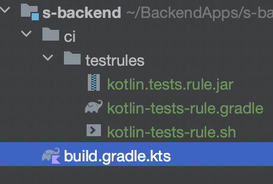

# Test source sets mirroring

The proposition is, test packages structure should be the same as source code structure. This is
true only if one creates classes at correct package structure at the first place. But usually,
source code and test code package structure diverge, and there is nothing to tell us when it's
happening.

Run `./gradlew kotlinTestRule` to fix possible issues with code structure.

After extracting code to
another module, there will be left test sources. These will be at `./undefinedTests/`. Move them
manually.

## Mirror test files structure from main source structure

1. Clone project
2. Build jar
    ```shell
    ./gradlew publishToMavenLocal
    ```
3. Copy that jar from `~/.m2/repository/ru/vorobeij/kotlin.tests.rule/1.0/*.jar`
4. Run with checks on CI
   ```shell
   java - jar kotlin-tests-rule.jar-- projectRoot "../"
   ```
5. If there are tests with incorrect packages, whole task will fail with
   ```shell
   Test source sets are not mirrored with code source sets. Run kotlin-tests-rule.jar locally
   ```

### OR



**kotlin-tests-rule.gradle**

```groovy
task kotlinTestRule(type: Exec) {
   workingDir(projectDir)
   commandLine 'sh', './ci/testrules/kotlin-tests-rule.sh'
}
```

**kotlin-tests-rule.sh**

```shell
#!/usr/bin/env bash

java - jar./ci/testrules/kotlin.tests.rule.jar --projectRoot ./
```

**build.gradle.kts**

```kotlin
apply(from = "./ci/testrules/kotlin-tests-rule.gradle")
```

# TODO

Make a gradle plugin from this project 